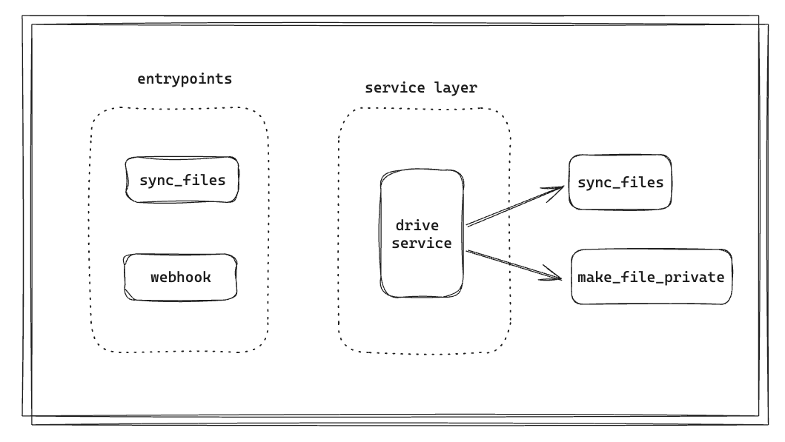

# Drive Inventory

Drive Inventory is a Python application that creates a database of a user's Google Drive files.
It saves file information such as name, extension, owner, visibility (public or private), and
the last update date. Additionally, if a file is public, the application changes its visibility
to private and sends an email to the owner informing them of the change, while also logging the
change in the database.

## Use Cases

#### What Do I Think Still Needs Improvement?

I am currently facing challenges in fully understanding how the Google Drive API's webhook functionality operates. While I was able to set up the entry point for the webhook, the responses received from Google lacked detailed information. Consequently, I was unable to devise an optimal method for accurately identifying changes occurring in the user's Drive. This lack of clarity in the webhook responses has hindered my ability to effectively track and manage updates in the user's Google Drive.



Additionally, there is a need to enhance the security layer for storing credentials properly. For instance, integrating a [vault](https://github.com/hashicorp/vault) into the project would allow the application to securely fetch credentials at startup. This approach would ensure that sensitive information, such as API keys and database credentials, is handled securely, reducing the risk of exposure and improving overall security.

### Use Case 1: Sync Google Drive Files
- **Description**: Sync a user's Google Drive files with the database.
- **Solution**: Utilizes the Google Drive API to list and retrieve file information. This
  information is then saved in a MongoDB database.

### Use Case 2: Change File Visibility
- **Description**: If a file is public, change its visibility to private.
- **Solution**: During synchronization, the visibility of files is checked. If a file is public,
  the Google Drive API is used to change its visibility to private, and an email notification is
  sent to the owner.

### Use Case 3: Log Changes
- **Description**: Log changes in file visibility.
- **Solution**: Detailed logs are saved in the MongoDB database whenever a visibility change is
  made.

## Requirements

- Python 3.8+
- MongoDB
- Docker (optional, for running with containers)

## Installation

### Clone the Repository

```sh
git clone https://github.com/yourusername/drive-inventory.git
cd drive-inventory
```

### Running Locally

1. **Install dependencies**:

Assuming you have `Poetry` installed, run:

```sh
poetry install
```

2. **Run the application**:

```sh
poetry run python -m drive_inventory.entrypoints.sync_files
```

### Automated Tests

To run the automated tests using `pytest`, run:

```sh
poetry run pytest
```

## References

- [Cosmic Python](https://www.cosmicpython.com/)
- [Drive API](https://developers.google.com/resources/api-libraries/documentation/drive/v3/python/latest/index.html)
- [Gmail API](https://developers.google.com/resources/api-libraries/documentation/gmail/v1/python/latest/gmail_v1.users.messages.html#send)
